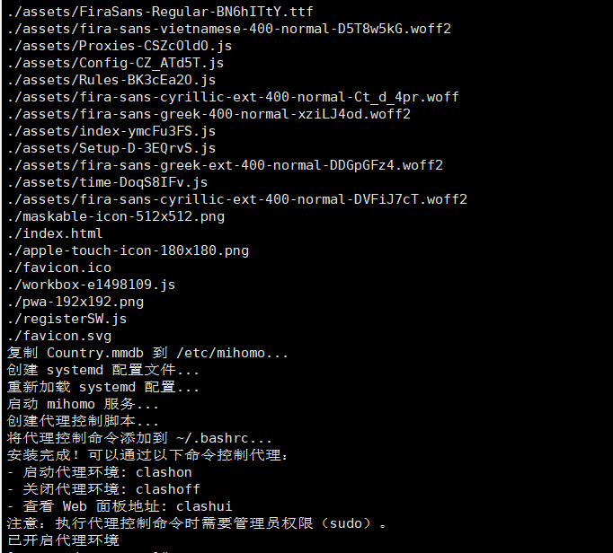
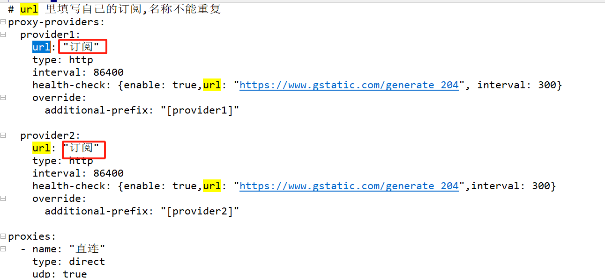
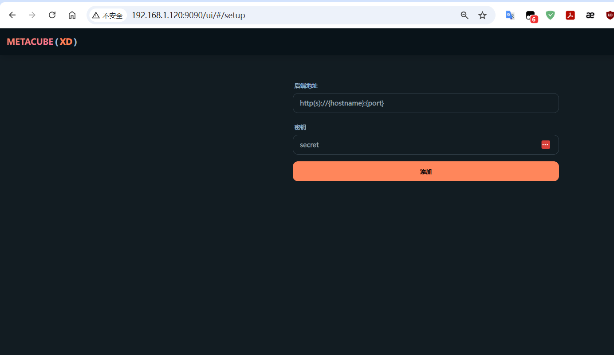
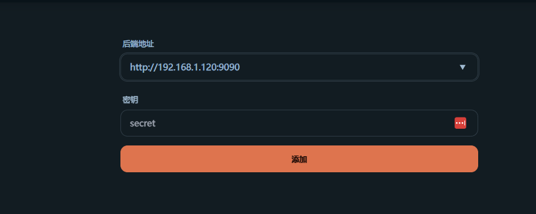
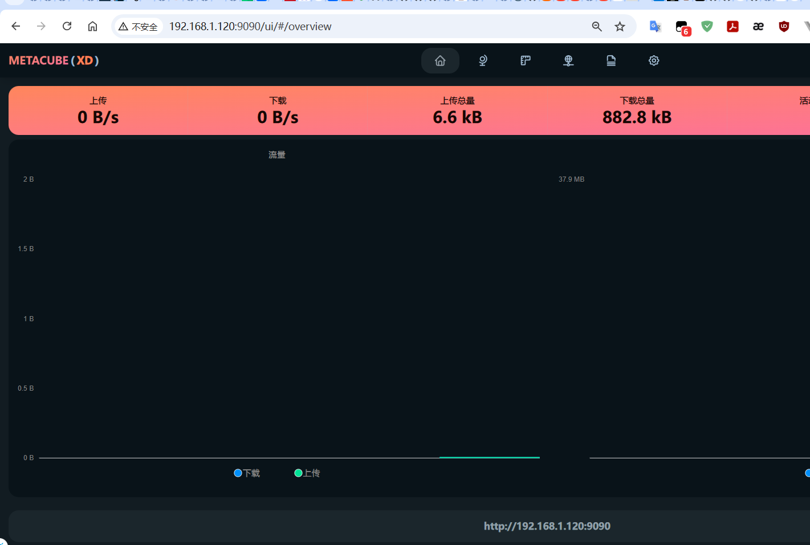

# Mihomo Linux 一键安装脚本

支持自动架构检测、智能代理加速、定时订阅更新的Mihomo安装器

---

**作者**: tianyufeng925

**项目地址**: https://github.com/tianyufeng925/mihomo-for-linux-install

**许可证**: MIT License

**更新时间**: 2025-08-01

## ⚖️ 重要法律声明

> **🚨 请务必仔细阅读以下法律声明**

### 免责声明
1. **本项目仅供学习、研究和技术交流使用**，不得用于任何违法违规活动
2. 用户应当遵守所在国家和地区的法律法规，合法合规使用本软件
3. 在中华人民共和国境内，用户应严格遵守《网络安全法》《数据安全法》《个人信息保护法》等相关法律法规
4. **本项目作者不对用户的任何违法行为承担责任**
5. 如因使用本项目导致的任何法律后果，均由用户自行承担
6. **用户使用本项目即表示同意本免责声明的全部内容**

### 合规使用建议
- ✅ 仅在合法授权的网络环境中使用
- ✅ 企业用户应确保符合公司网络安全政策
- ✅ 个人用户应遵守当地互联网管理规定
- ❌ 不得用于访问被法律禁止的网络内容
- ❌ 不得用于任何违法犯罪活动

### 技术说明
本项目安装的 Mihomo 是一个开源的网络代理工具，具有以下**合法用途**：
- 🏢 企业内网代理和负载均衡
- 🔧 开发测试环境的网络配置
- 📊 合规的网络流量管理和监控
- 📚 学习网络协议和代理技术

**如有法律疑问，请咨询专业法律人士意见。**

---

## 🔥 主要特性

### � 业界最强的兼容性
- ✅ **多架构支持**: x86_64、ARM64、ARMv7、ARMv6、MIPS64、MIPS
- ✅ **多系统支持**: Ubuntu、Debian、CentOS、RHEL、Fedora、Arch、麒麟、统信
- ✅ **简单安装**: 一条命令完成安装

### 🌐 智能代理加速
- 🚀 **12个代理镜像**: 多个GitHub代理源，提高下载成功率
- 🧠 **智能选择算法**: 自动测试并选择最快的镜像
- 🔄 **多重备用机制**: 网络环境差时自动切换下载源

### ⚡ 自动化管理
- 🤖 **定时订阅更新**: 自动更新代理节点配置
- 🛡️ **配置验证**: 自动检查配置文件语法
- 📊 **日志管理**: 完整的日志记录和查看功能
- 🎛️ **便捷操作**: 提供多个管理命令简化操作

### 🏆 技术特点
- **模块化架构**: 松耦合设计，便于扩展
- **独立功能**: 每个功能可独立启用/禁用
- **向下兼容**: 兼容原版配置
- **稳定可靠**: 经过测试验证

## 🎯 适用场景

| 用户类型 | 推荐理由 | 核心优势 |
|---------|---------|---------|
| 🔰 **新手用户** | 一键安装，简单易用 | 智能选择器自动推荐合适方案 |
| 💻 **技术用户** | 功能丰富，可定制 | 多个管理命令，满足不同需求 |
| 🏢 **企业用户** | 稳定可靠，易维护 | 完整的日志和监控功能 |
| 🌍 **海外用户** | 网络优化，连接稳定 | 智能代理加速，提高可用性 |
| 🇨🇳 **国内用户** | 针对优化，体验良好 | 12个代理镜像，提高下载成功率 |

## 🤖 自动更新机制

- **GitHub Actions自动更新**: 每天自动检查并更新到最新版本
- **Dependabot集成**: 自动更新项目依赖和GitHub Actions
- **手动更新脚本**: 支持手动指定版本更新
- **版本追踪**: 自动更新文档和版本记录

详细说明请查看: [自动更新文档](docs/AUTO_UPDATE.md)

## 🏗️ 技术架构

基于 **mihomo** 核心 + **metacubexd** Web UI，采用模块化设计：

- **核心程序**: [mihomo](https://github.com/MetaCubeX/mihomo) - 高性能代理内核
- **Web界面**: [metacubexd](https://github.com/MetaCubeX/metacubexd) - 现代化管理界面
- **增强脚本**: 订阅更新器、配置验证器、日志管理器
- **系统集成**: systemd 服务、cron 定时任务、环境变量管理

## 📋 环境要求

### 系统要求
- **操作系统**: Linux (内核版本 3.10+)
- **权限**: root 或 sudo 权限
- **系统服务**: systemd 支持
- **Shell**: bash 4.0+

### 支持的发行版
- **Ubuntu**: 18.04+ (推荐 20.04/22.04 LTS)
- **Debian**: 9+ (推荐 11/12)
- **CentOS/RHEL**: 7+ (推荐 8/9)
- **Rocky Linux**: 8+
- **Fedora**: 30+
- **Arch Linux**: 最新版本

### 支持的架构
- **x86_64** (amd64) - 主流64位架构
- **ARM64** (aarch64) - ARM 64位架构
- **ARMv7** (armhf) - ARM 32位架构
- **ARMv6** - 树莓派等设备
- **MIPS64/MIPS** - 路由器等设备

### 必需工具

**⚠️ 执行安装前必须具备：**
- `curl` 或 `wget` - **必须预先安装**，用于下载安装脚本

**安装脚本会自动检测并安装以下工具（如果缺失）：**
- `unzip` - 解压缩文件
- `gzip` - 压缩文件处理
- `systemctl` - 系统服务管理
- `tar` - 文件归档处理

> 📝 **注意**: 由于一键安装命令本身需要curl/wget来下载脚本，这两个工具必须预先安装。其他工具缺失时，我们的系统检测器会自动安装。

## 🚀 快速开始

### 1️⃣ 准备Linux服务器

确保您有一台运行Linux系统的服务器，支持**CentOS、Ubuntu、Debian**等主流发行版，及**麒麟、统信**等国产操作系统。

支持各种服务器架构：**x86_64、aarch64、armv7l、armv6l、mips64、mips**等。

### ⚠️ 重要前提条件

**在执行一键安装命令前，请确保系统已安装基础网络工具：**

```bash
# Debian/Ubuntu系统
apt update && apt install -y curl

# CentOS/RHEL系统
yum install -y curl

# 或者使用wget（二选一即可）
apt install -y wget  # Debian/Ubuntu
yum install -y wget   # CentOS/RHEL
```

> 💡 **说明**: 最小化安装的Linux系统可能缺少curl/wget工具，需要先安装才能执行一键安装命令。我们的安装脚本会自动检测和安装其他缺失的工具。

### 2️⃣ 运行安装脚本
以root用户身份运行一键安装脚本，自动完成Mihomo的下载和安装。

> 🚨 **重要提醒**: 如果执行时提示 `curl: command not found`，请先安装curl：
> ```bash
> # Debian/Ubuntu: apt update && apt install -y curl
> # CentOS/RHEL: yum install -y curl
> ```

#### 🎯 智能选择器（推荐）
自动检测网络环境，智能选择合适的安装方式：
```bash
bash -c "$(curl -sSL https://raw.githubusercontent.com/tianyufeng925/mihomo-for-linux-install/main/quick_install.sh)"
```

#### 📡 标准版（网络环境良好）
```bash
bash -c "$(curl -sSL https://raw.githubusercontent.com/tianyufeng925/mihomo-for-linux-install/main/install.sh)"
```

#### 🌐 代理加速版（网络受限环境）
```bash
bash -c "$(curl -sSL https://mirror.ghproxy.com/https://raw.githubusercontent.com/tianyufeng925/mihomo-for-linux-install/main/install_proxy.sh)"
```

#### 🔄 网络不稳定环境（推荐重试机制）
如果网络环境不稳定，建议使用带重试机制的安装方式：
```bash
# 智能重试安装（推荐）
for i in {1..3}; do
    echo "尝试第 $i 次安装..."
    timeout 120 bash -c "$(curl -sSL https://raw.githubusercontent.com/tianyufeng925/mihomo-for-linux-install/main/install.sh)" && break
    sleep 10
done
```

```bash
# 代理版重试安装
for i in {1..3}; do
    echo "尝试第 $i 次安装..."
    timeout 120 bash -c "$(curl -sSL https://raw.githubusercontent.com/tianyufeng925/mihomo-for-linux-install/main/install_proxy.sh)" && break
    sleep 10
done
```

### 3️⃣ 开始使用
安装完成后，立即可用：
```bash
clashon       # 启动Mihomo服务
clashoff      # 停止Mihomo服务
clashstatus   # 查看服务状态
```

```bash
# 方式二：使用代理下载
wget https://mirror.ghproxy.com/https://raw.githubusercontent.com/tianyufeng925/mihomo-for-linux-install/main/install_proxy.sh
sudo bash install_proxy.sh
```

### 🔧 离线安装

如果网络环境极其受限，可以先下载整个项目：

```bash
# 下载项目压缩包（可使用任意可用的镜像）
curl -L https://mirror.ghproxy.com/https://github.com/tianyufeng925/mihomo-for-linux-install/archive/main.zip -o mihomo-install.zip
unzip mihomo-install.zip
cd mihomo-for-linux-install-main

# 根据网络情况选择版本
sudo bash install.sh        # 标准版
sudo bash install_proxy.sh  # 代理加速版
```

### 📊 版本对比

| 特性 | 标准版 (install.sh) | 代理加速版 (install_proxy.sh) |
|------|-------------------|---------------------------|
| 适用环境 | 网络环境良好 | 网络受限/较慢 |
| 下载源 | GitHub直连 | 12个代理镜像 |
| 连接测试 | 基础连接测试 | 智能代理选择 |
| 下载速度 | 取决于网络 | 自动选择最快镜像 |
| 稳定性 | 高（直连） | 高（多重备用） |
| 功能完整性 | ✅ 完整 | ✅ 完整 |

### 🌐 支持的代理镜像服务

代理加速版支持以下镜像服务（按优先级排序）：

#### 🥇 专业代理服务（推荐）
- **mirror.ghproxy.com** - 稳定性高，速度快
- **ghproxy.com** - 老牌代理服务
- **gh-proxy.com** - 备用代理
- **github.abskoop.workers.dev** - Cloudflare Workers

#### 🥈 国内镜像服务
- **kkgithub.com** - 替换域名访问
- **githubfast.com** - 快速访问镜像
- **hub.gitmirror.com** - Git镜像服务
- **gitclone.com** - 克隆加速

#### 🥉 备用服务
- **cors.isteed.cc** - CORS代理
- **github.moeyy.xyz** - 个人维护镜像
- **github.com.cnpmjs.org** - NPM镜像
- **download.fastgit.org** - FastGit服务

> 💡 **智能选择**: 代理加速版会自动测试所有镜像的连接速度，选择最快的进行下载

## 🎯 安装过程

### 标准版安装流程

1. **系统检测**: 自动识别架构和操作系统
2. **依赖检查**: 验证必需工具是否已安装
3. **连接测试**: 测试GitHub连接状态
4. **版本获取**: 从GitHub API获取最新版本信息
5. **文件下载**: 直连下载对应架构的程序文件
6. **功能配置**: 选择要启用的增强功能
7. **服务部署**: 配置systemd服务和定时任务
8. **环境设置**: 配置命令行环境和权限
9. **验证测试**: 验证安装结果和配置正确性

### 代理加速版安装流程

1. **系统检测**: 自动识别架构和操作系统
2. **依赖检查**: 验证必需工具是否已安装
3. **代理测试**: 测试12个代理镜像的连接速度
4. **智能选择**: 自动选择最快的代理镜像
5. **版本获取**: 通过代理获取最新版本信息
6. **加速下载**: 使用合适的代理下载程序文件
7. **功能配置**: 选择要启用的增强功能
8. **服务部署**: 配置systemd服务和定时任务
9. **环境设置**: 配置命令行环境和权限
10. **验证测试**: 验证安装结果和配置正确性

### � 备用机制

两个版本都支持以下备用机制：

- **本地文件备用**: 网络下载失败时自动使用本地文件
- **版本回退**: 无法获取最新版本时使用稳定版本
- **多重重试**: 下载失败时自动重试（最多3次）
- **断点续传**: 支持大文件的断点续传下载

> 💡 **选择建议**:
> - 网络环境良好 → 使用标准版 (`install.sh`)
> - 网络受限/较慢 → 使用代理加速版 (`install_proxy.sh`)

## 📖 使用指南

### 🔧 便捷管理命令

```bash
# 启动Mihomo服务
clashon

# 停止Mihomo服务
clashoff

# 重启Mihomo服务
clashrestart

# 查看服务状态
clashstatus

# 查看实时日志
clashlog
```

### 📡 订阅管理命令

```bash
# 手动更新订阅
clashsub update

# 查看订阅状态
clashsub status

# 查看更新日志
clashsub log
```

### ⚙️ 配置管理命令

```bash
# 验证配置文件
clashconfig validate

# 手动备份配置
clashconfig backup

# 查看备份文件
clashconfig restore
```

### 📊 日志管理命令

```bash
# 查看日志 (mihomo/subscription/error)
clashlog view [类型]

# 实时跟踪日志
clashlog follow [类型]

# 清理所有日志
clashlog clear

# 显示日志统计
clashlog stats
```

### 🌐 Web 管理界面

安装完成后，可以通过以下地址访问 Web 管理界面：

- **本地访问**: http://127.0.0.1:9090/ui
- **局域网访问**: http://[服务器IP]:9090/ui

> 🔐 **安全提示**: 建议为 Web 界面设置密码保护，在配置文件中添加 `secret` 字段



## ⚙️ 配置说明

### 📝 配置文件位置

- **主配置文件**: `/etc/mihomo/config.yaml`
- **增强功能配置**: `/etc/mihomo/.mihomo_config`
- **日志文件**: `/etc/mihomo/logs/`
- **备份文件**: `/etc/mihomo/backups/`
- **脚本文件**: `/etc/mihomo/scripts/`

### 🔗 添加订阅

#### 方法一：编辑配置文件

```bash
# 编辑主配置文件
sudo vi /etc/mihomo/config.yaml
```

在 `proxy-providers` 部分替换订阅URL：

```yaml
proxy-providers:
  provider1:
    url: "https://your-subscription-url-here"  # 替换为您的订阅URL
    type: http
    interval: 86400
    health-check:
      enable: true
      url: "https://www.gstatic.com/generate_204"
      interval: 300
```

#### 方法二：使用命令行工具

```bash
# 验证配置文件
clashconfig validate

# 备份当前配置
clashconfig backup

# 重启服务使配置生效
sudo systemctl restart mihomo
```

### 🔄 自动更新配置

增强版支持自动订阅更新，配置位于 `/etc/mihomo/.mihomo_config`：

```bash
# 自动更新配置
ENABLE_AUTO_UPDATE=true      # 启用自动更新
UPDATE_INTERVAL=6            # 更新间隔（小时）
UPDATE_RETRY_COUNT=3         # 重试次数
UPDATE_TIMEOUT=30            # 超时时间（秒）

# 配置验证
ENABLE_CONFIG_VALIDATION=true  # 启用配置验证
VALIDATION_ON_UPDATE=true      # 更新时验证配置

# 日志管理
ENABLE_LOG_MANAGEMENT=true     # 启用日志管理
LOG_MAX_SIZE=10M              # 日志文件最大大小
LOG_MAX_FILES=10              # 保留日志文件数量
LOG_MAX_DAYS=30               # 日志保留天数
```

### 📋 定时任务管理

查看和管理自动更新任务：

```bash
# 查看当前定时任务
crontab -l

# 手动编辑定时任务
crontab -e

# 查看定时任务执行日志
clashlog view subscription
```



```
sudo systemctl restart mihomo
```

## 🔧 故障排除

### 安装问题

#### 1. 网络连接问题
```bash
# 症状：安装时出现连接超时或下载失败
# 解决方案：使用重试机制
for i in {1..3}; do
    echo "尝试第 $i 次安装..."
    timeout 120 bash -c "$(curl -sSL https://raw.githubusercontent.com/tianyufeng925/mihomo-for-linux-install/main/install.sh)" && break
    sleep 10
done
```

#### 2. 脚本执行错误
```bash
# 症状：出现 "log_warn: 未找到命令" 或 "local: 只能在函数中使用"
# 原因：脚本版本问题，已在最新版本中修复
# 解决方案：确保使用最新版本的脚本

# 检查脚本版本
curl -sSL https://raw.githubusercontent.com/tianyufeng925/mihomo-for-linux-install/main/VERSION.md

# 强制重新下载最新版本
curl -sSL https://raw.githubusercontent.com/tianyufeng925/mihomo-for-linux-install/main/install.sh -o install.sh
sudo bash install.sh
```

#### 3. 代理镜像失效
```bash
# 症状：下载的是HTML页面而不是脚本
# 解决方案：尝试不同的下载源

# 方法1：直接使用GitHub
bash -c "$(curl -sSL https://raw.githubusercontent.com/tianyufeng925/mihomo-for-linux-install/main/install.sh)"

# 方法2：使用代理版本
bash -c "$(curl -sSL https://raw.githubusercontent.com/tianyufeng925/mihomo-for-linux-install/main/install_proxy.sh)"

# 方法3：手动下载验证
wget https://raw.githubusercontent.com/tianyufeng925/mihomo-for-linux-install/main/install.sh
head -5 install.sh  # 确认是脚本文件而不是HTML
sudo bash install.sh
```

### 运行问题

#### 1. 服务启动失败

```bash
# 查看服务状态
sudo systemctl status mihomo

# 查看详细日志
clashlog view error

# 验证配置文件
clashconfig validate

# 重启服务
sudo systemctl restart mihomo
```

#### 2. 订阅更新失败

```bash
# 查看更新日志
clashsub log

# 手动更新测试
clashsub update

# 检查网络连接
curl -I https://www.google.com
```

#### 3. 端口冲突

```bash
# 检查端口占用
sudo netstat -tlnp | grep -E ":(7890|9090)"

# 修改配置文件中的端口
sudo vi /etc/mihomo/config.yaml
```

## 🌐 Web 管理面板

### 访问地址

安装完成后，通过以下地址访问管理面板：

- **本地访问**: http://127.0.0.1:9090/ui
- **局域网访问**: http://[服务器IP]:9090/ui



### 添加配置

在 Web 界面中点击"添加"按钮，输入配置信息：



### 节点管理

可以在界面中查看和管理所有代理节点：



## 🗑️ 卸载

### 完全卸载

```bash
# 运行卸载脚本
sudo bash uninstall.sh
```

### 手动清理

```bash
# 停止服务
sudo systemctl stop mihomo
sudo systemctl disable mihomo

# 删除文件
sudo rm -rf /etc/mihomo
sudo rm -f /etc/systemd/system/mihomo.service

# 清理定时任务
crontab -l | grep -v "subscription_updater.sh" | crontab -

# 重新加载systemd
sudo systemctl daemon-reload
```

## 📈 版本历史

### v2.0 (增强版) - 2025-01-29
- ✨ 新增自动架构检测和版本下载
- 🔄 新增定时订阅更新功能
- 🛡️ 新增配置文件验证功能
- 📊 新增日志管理系统
- 🎛️ 新增增强控制命令
- 🌐 优化 Web UI 集成
- 🔧 完善错误处理和故障排除

### v1.0 (基础版)
- 📦 基础一键安装功能
- 🚀 systemd 服务集成
- 🎯 基础代理控制命令

## 🤝 贡献

欢迎提交 Issue 和 Pull Request 来改进这个项目！

### 贡献指南

1. Fork 本仓库
2. 创建特性分支 (`git checkout -b feature/AmazingFeature`)
3. 提交更改 (`git commit -m 'Add some AmazingFeature'`)
4. 推送到分支 (`git push origin feature/AmazingFeature`)
5. 开启 Pull Request

## 📞 支持

如果您遇到问题或有建议，请：

1. 查看 [故障排除](#-故障排除) 部分
2. 搜索现有的 [Issues](https://github.com/tianyufeng925/mihomo-for-linux-install/issues)
3. 创建新的 Issue 并提供详细信息

## 🙏 致谢

感谢以下项目和贡献者：

- [@nelvko](https://github.com/nelvko) - 原始项目灵感
- [clash-for-linux-install](https://github.com/nelvko/clash-for-linux-install) - 基础框架参考
- [MetaCubeX/mihomo](https://github.com/MetaCubeX/mihomo) - 核心代理程序
- [MetaCubeX/metacubexd](https://github.com/MetaCubeX/metacubexd) - Web 管理界面

## 📚 相关项目

- [mihomo](https://github.com/MetaCubeX/mihomo) - 高性能代理内核
- [metacubexd](https://github.com/MetaCubeX/metacubexd) - 现代化 Web 界面
- [clash-for-linux-install](https://github.com/nelvko/clash-for-linux-install) - 原始安装脚本

## ⚖️ 免责声明

1. **学习目的**: 本项目主要用于学习和研究 Shell 编程及系统管理技术
2. **合法使用**: 请确保在您所在的国家/地区法律法规允许的范围内使用
3. **风险自担**: 使用本项目所产生的任何后果由使用者自行承担
4. **更新权利**: 项目保留随时更新免责声明的权利

## 📄 许可证

本项目采用 MIT 许可证 - 查看 [LICENSE](LICENSE) 文件了解详情

---

<div align="center">

**⭐ 如果这个项目对您有帮助，请给个 Star 支持一下！**

Made with ❤️ by [tianyufeng925](https://github.com/tianyufeng925)

</div>
